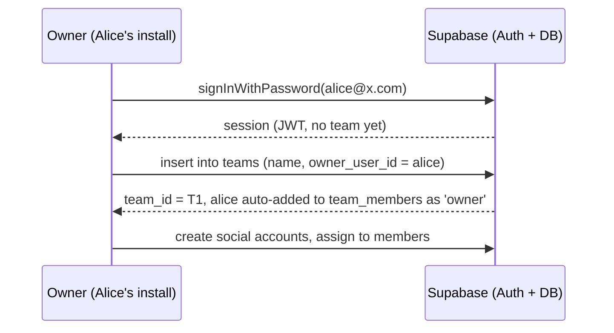
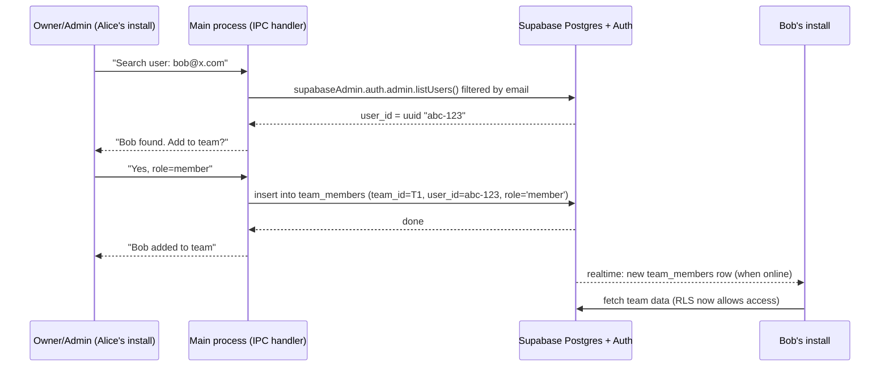
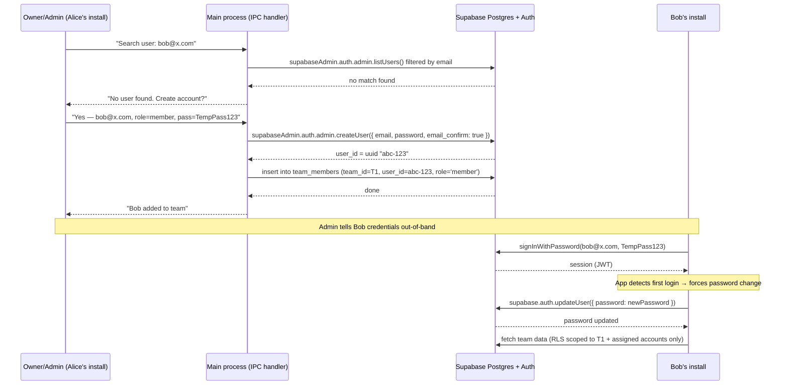
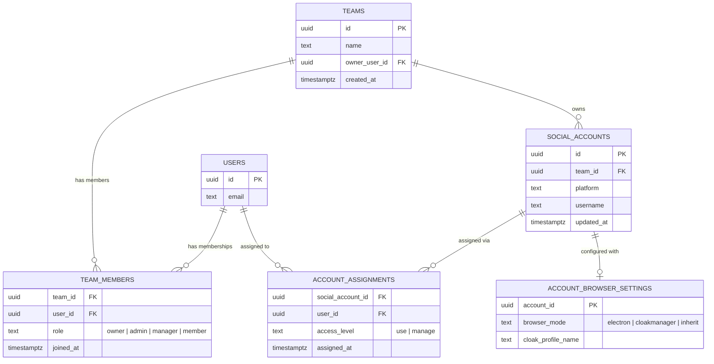
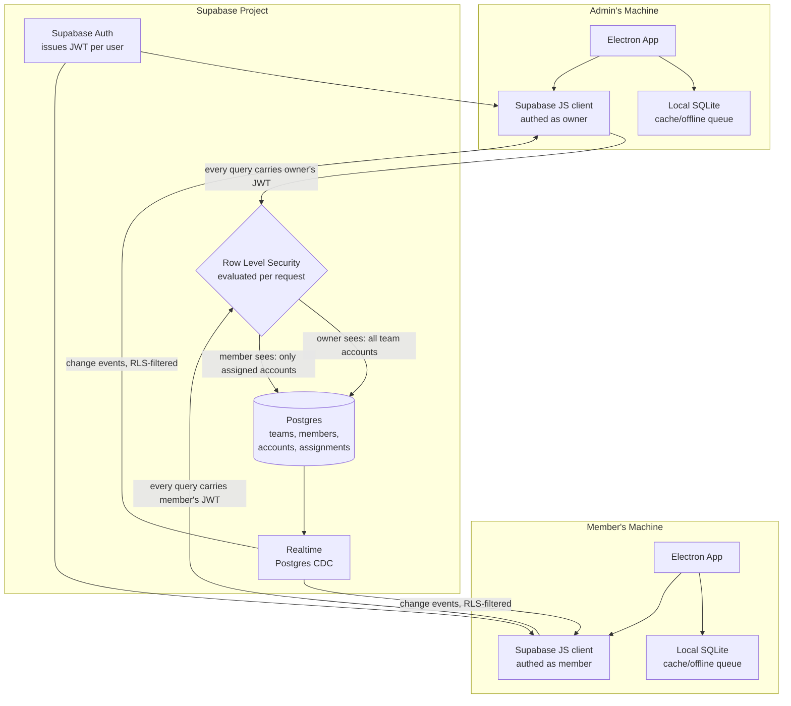
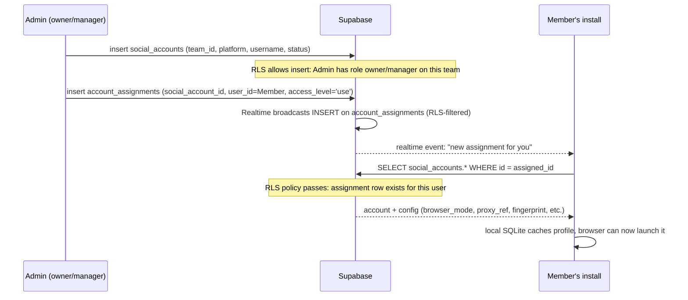
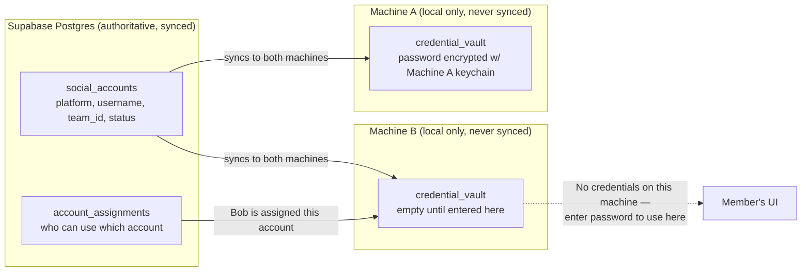

# Team Architecture — Research & Design

## Multi-installation team model for shared social-account management

---

## 0. End-to-end app behavior — the complete picture

This section describes exactly how the app works in practice under the new architecture — every user journey, every role boundary, every interaction between the local app and Supabase. Read this first to understand the whole, then the detailed sections below for the mechanics.

### 0.1 What the app is (unchanged)

Oserus Management is an Electron desktop app for managing social-media accounts across Reddit, X, Instagram, and TikTok. Its core features — all of which carry over unchanged — are:

| Feature | What it does |
|---------|-------------|
| **Oserus Browser** | Frameless Chromium window with per-account session isolation, proxy binding, antidetect fingerprint spoofing, custom tab strip, bookmarks, omnibox |
| **Model profiles** | Group accounts by model/persona with brand voice, niche, proxy assignment |
| **Account CRUD** | Create, import, edit, delete platform accounts with status lifecycle (warming → ready → paused → banned) |
| **Proxy management** | HTTP/HTTPS/SOCKS5 proxies with per-account assignment, rotation, auto-testing |
| **AI content generation** | Claude → Grok → OpenAI cascade for post and comment generation with per-account voice seeding |
| **Autopilot** | Background posting with configurable intervals, daily caps, quiet hours, eligibility checks |
| **Engagement automation** | Hidden-browser scroll/like/follow/comment with human-like patterns |
| **Scheduler Pro** | Kanban board, scheduled posts with boost integration, conflict detection, templates |
| **Analytics** | Karma snapshots, per-platform rollups |
| **Inbox (Account Manager Pro)** | Multi-account Reddit inbox polling, threading, reply templates |
| **Intelligence** | Reddit subreddit discovery, karma requirements, compatibility analysis |
| **System tray + auto-updater** | Minimize to tray, GitHub releases auto-update |

**None of these features change** under the new architecture. What changes is **where the data comes from and who can see it.** The UI, the browser, the automation — all work identically.

### 0.2 The user's day

**Alice is the team owner.** She manages 5 models with 30 Reddit/X accounts across her team of 3 operators.

**Morning:** Alice opens the app on her laptop. The login screen shows email + password fields (no more `admin/changeme`). She signs in.

The app authenticates via `supabase.auth.signInWithPassword()`. The JWT is stored in `safeStorage`. On first query, Supabase RLS returns: Alice is `owner` of team "Acme." The app pulls all team data — accounts, profiles, proxies, assignments, machine registry — into local SQLite via authenticated queries. This takes ~2 seconds on first load.

Alice sees the Dashboard with all team accounts, all machines, live locks, and activity from all operators. She can navigate to any model, any account, any settings page.

**Alice adds a new operator.** She goes to **Team → Add member**, types `bob@x.com`. The app searches for an existing user via a server-side lookup (Section 4.1.1). No user found. Alice enters a temp password and role `member`. A new account is created server-side, a `team_members` row is inserted. She tells Bob his credentials.

**Alice assigns accounts.** She opens a model profile, sees its 10 Reddit accounts. She selects 5 of them, clicks **Assign to member**, picks Bob. Rows are inserted into `account_assignments`. Bob's machine receives a realtime event and caches the new accounts locally.

**Bob's first login.** Bob installs the app on his work PC. Opens it, enters his email and the temp password. The app forces a password change. Now the app queries Supabase: Bob is `member` of team "Acme." RLS returns only the 5 accounts assigned to him. They're cached in local SQLite. Bob sees a simplified Dashboard — his 5 accounts, no other members' data, no Settings tab, no Users tab.

Bob clicks one of his accounts. The app checks local `credential_vault` — no password stored yet on this machine. It shows: *"No password on this machine. Enter the Reddit password to use this account here."* Bob enters it once. It's encrypted with his machine's `safeStorage` and stored locally. Never synced.

Bob launches the Oserus Browser for this account. The app reads the account's fingerprint config, proxy, and user agent from local SQLite (all cached from Supabase). It sets up the Electron session partition, applies the antidetect preload, and opens the browser. Bob logs into Reddit manually (same as today). Everything works offline from here.

**Bob runs autopilot.** He enables autopilot for his assigned accounts. The coordinator tries to acquire a lock in Postgres for each account. The `post_locks` table's `UNIQUE(social_account_id)` constraint ensures only one machine holds the lock. Bob's machine acquires locks for 3 of his 5 accounts. The other 2 are already held by another operator — those skip this tick.

**Alice oversees the team.** She opens the **Machines** tab and sees Bob's workstation, its autopilot status, when it was last seen. She can toggle Bob's autopilot off remotely — the next heartbeat on Bob's machine picks up the change and stops the coordinator.

**Alice removes Bob from the team.** Bob leaves the agency. Alice deletes Bob's `team_members` row. Bob's next query to Supabase returns empty — his JWT no longer satisfies any RLS policy for team "Acme." The local cache is purged. Bob's UI shows *"You're no longer a member of this team."* Any cached accounts remain on disk but the UI refuses to launch them (the app re-checks RLS before every launch).

### 0.3 What a member sees vs what an owner sees

| Page/surface | Owner/Admin/Manager | Member |
|---|---|---|
| **Dashboard** | All accounts, all machines, all activity, live locks | Assigned accounts only, own machine only, own activity only |
| **Models** | All model profiles | Only models that have at least one assigned account |
| **Accounts** | All accounts, CRUD buttons, proxy assignment | Assigned accounts only, read-only except credential entry |
| **Oserus Browser** | Launch any account | Launch only assigned accounts |
| **Autopilot** | Toggle for any account, see all protocols | Toggle only for assigned accounts |
| **Scheduler** | Schedule for any account | Schedule only for assigned accounts |
| **Inbox** | All accounts' inboxes | Assigned accounts' inboxes only |
| **Intelligence** | Full access | Full access (read-only tool) |
| **Analytics** | All accounts' analytics | Assigned accounts' analytics only |
| **Team → Members** | Add/remove members, change roles | Not visible |
| **Team → Machines** | All machines, remote autopilot toggle | Own machine only |
| **Settings** | All settings including AI keys, cloud config | Limited to personal preferences |

### 0.4 Local app behavior — one machine, one user

A machine is used by one person at a time (shared machines are possible but rare). The app stores:

**In local SQLite (cached from Supabase):**
- Social accounts the logged-in user can see (filtered by RLS at cache time)
- Model profiles tied to those accounts
- Proxy configs
- Credential vault (locally encrypted, never synced)
- Post drafts, scheduled posts, activity log, karma snapshots
- Autopilot protocols, engagement configs
- Content sources, subreddit lists, templates
- Team info, machine registry (for the teams the user belongs to)

**In safeStorage (OS keychain):**
- Supabase Auth JWT (access + refresh tokens)
- Optional: local device PIN for lock-screen

**What happens on logout:**
- JWT is cleared from `safeStorage`
- Local SQLite data is **kept** (so if the same user logs back in, cached data is immediately available while Supabase re-queries in the background)
- New login validates against Supabase Auth, re-populates cache with whatever RLS allows at that moment

**What happens when a different user logs in on the same machine:**
- Previous user's cache is **not automatically wiped** (it would take time and there's no security benefit — the data is only accessible to a logged-in session that passes RLS)
- New user's data is fetched from Supabase and cached alongside the old data
- Old data becomes inaccessible because the UI only shows what RLS returns for the current user

**What happens offline:**
- If the JWT is still valid (cached in `safeStorage`), the user can do everything — launch browsers, post, run engagement — because all reads come from local SQLite
- Writes queue locally and replay on reconnect; RLS is checked at write time, not before
- If the JWT has expired, the user sees a re-auth screen but cached data remains available; they just can't write until they re-authenticate

### 0.5 How data flows — the read and write paths

**Reading data (e.g., loading the account list):**

```
User opens account list
  → React component calls window.api.accounts.listForUser({ token })
  → IPC handler in main process reads from local SQLite
  → Returns immediately (no network needed)
```

Background: the local cache is populated on login and kept fresh via realtime subscriptions + periodic refresh. No read ever blocks on the network.

**Writing data (e.g., creating a new account):**

```
User fills form and clicks Save
  → React sends IPC: window.api.accounts.create({ platform, username, ... })
  → IPC handler:
      1. Inserts into local SQLite immediately (optimistic)
      2. Sends to Supabase: supabaseClient.from('social_accounts').insert({...})
      3. If Supabase accepts → done (local write was correct)
      4. If Supabase rejects (RLS) → rolls back local write, surfaces error
  → UI updates from local SQLite regardless
```

This is the same optimistic pattern the current app uses for many operations — the difference is that the write goes directly to Supabase with the user's JWT instead of going through a watermark-based sync queue.

### 0.6 What's new vs what's unchanged

| Aspect | Unchanged | Changed |
|--------|-----------|---------|
| Oserus Browser | Same architecture, same antidetect, same proxy binding | No change |
| Account launching | Session prep, fingerprint, proxy bridge, preload injection | No change |
| UI pages | All existing pages (Dashboard, Profiles, Analytics, Autopilot, Scheduler, Inbox, Intelligence, Settings, etc.) | Navigation is identical. Some elements hidden based on RLS rather than local permissions. |
| Permission checks | Renderer still checks permissions before showing UI elements | RLS is now the real enforcement layer — renderer gating is defense-in-depth |
| Login | Email + password (was username + password) | Auth source is Supabase Auth, not local bcrypt. New users sign up or are created by admin. |
| Team management | Was "Users" page in Settings | New dedicated Team section with Members, Machines, Invites |
| Data isolation | Every user saw everything | RLS scopes data per-user based on team membership + assignments |
| Sync | Watermark-based push/pull with anon key | Direct JWT-authenticated queries + realtime. No sync loop. |
| Credentials | Encrypted blobs synced to all machines (broken) | `credential_vault` local-only, per-machine entry |

### 0.7 Pages that need modification

Most pages stay the same but read from different data sources. Pages that need UI changes:

| Page | What changes |
|------|-------------|
| **Login** | Email + password instead of username. Add "Create account" option. Remove "Default admin" hint. |
| **Shell** | Add team switcher if user belongs to multiple teams. Show current team name. |
| **Dashboard** | Add machines section, locks view. Scope data to current team. |
| **Users** → redesign as **Team** | New page with Members tab (add, remove, change roles), Machines tab (heartbeat status, remote autopilot toggle), Assignments tab. |
| **Settings** | Cloud sync section simplified (no push/pull/resync buttons — those are obsolete). |
| **Account detail** | Add credential vault status indicator (green = stored on this machine, yellow = not stored). "Enter password" prompt. |

---

## 1. What we're actually building

Today: one Electron install = one isolated database, optionally mirrored into a shared Supabase project where every install can read/write every row.

What the product needs to be: **many independent desktop installations that behave as one team**, where:

- One person is the **admin** — they create the team and decide who's in it.
- Other people **join** that team from their own installation, on their own computer.
- The admin **assigns specific social accounts/profiles** to specific members.
- A member's installation should only ever see the accounts assigned to *them* (or, for the admin, everything on the team).
- This should feel like the account-sharing model in anti-detect browsers (GoLogin, Multilogin, etc.) — profiles live in the cloud, get "checked out" by whoever they're shared with, and stay in sync — not like a shared read/write database where everyone sees everything.

The fix is not a licensing system. It's three missing structural pieces:

1. **Real identity** — Supabase needs to know *who* is asking, not just accept any request from anyone holding the anon key.
2. **A tenancy boundary** — a `team_id` (and an assignment layer under it) that every protected row is scoped to.
3. **Enforcement at the database**, via Row Level Security — not just hidden buttons in the Electron UI.

Everything below designs those three pieces.

### 1.1 Why Postgres is authoritative, not a peer

A separate deep-dive on the current codebase (referred to below as "the DeepSeek analysis") independently found a cluster of bugs — colliding auto-increment IDs across machines, silent username collisions, no cross-machine post-locking, `admin/changeme` syncing to every install — that all trace back to one root cause: **every machine's local SQLite is currently treated as an equally-authoritative peer**, with Supabase acting only as a replication bus between them. Two peers can independently mint `id = 5` for different records, independently create `username = "operator1"`, and independently believe they hold the lock on the same account — because nothing is actually in charge.

This document adopts the opposite model: **Postgres (via Supabase) is the single source of truth; local SQLite on every machine is a cache.** That single decision resolves several of the DeepSeek findings *by construction*, with no separate patch needed:

| DeepSeek finding | Why it disappears under the authoritative model |
|---|---|
| Colliding `INTEGER PRIMARY KEY AUTOINCREMENT` across machines | IDs are `uuid`, generated once, centrally, by Postgres at insert time. There is no second machine independently minting IDs to collide with — every row has exactly one authoritative ID from birth. No `global_id`-vs-local-`id` translation layer is needed. |
| Silent username collisions | `username`/`email` uniqueness is a single Postgres constraint checked at the one place writes happen. There's no "second machine's insert wins/loses a race after the fact" — the constraint either accepts or rejects the write synchronously, right there. |
| No cross-machine post-locking | Locks (Section 10) are just a table in the same authoritative Postgres database as everything else, governed by the same RLS/team scoping — not a separate "coordination backend" that has to be manually flipped on. |
| `admin/changeme` seeded on every fresh install | There is no local seed at all in this model (Section 4.4) — the first machine to run creates a team and its owner via real Supabase Auth signup, so there's no default credential to leak. |

What the DeepSeek analysis gets right *independent of this choice* — and which this document folds in as required additions, not optional patches — is that (a) OS-keychain-encrypted credentials are physically undecryptable on another machine and must never be synced as opaque blobs (Section 8.3), and (b) an admin needs real visibility into which machines are online and what they're doing (Section 11). Those two are addressed below.

---

## 2. Core concepts

| Concept | What it is |
|---|---|
| **User** | A real person, authenticated via Supabase Auth (email + password). One user account per person, usable from any device — not one account per installation. |
| **Installation** | A copy of the desktop app on one machine. Not itself an identity — it's just a window into whichever user is currently logged in on it. |
| **Team** | A tenant. Has exactly one owner (the admin who created it) and any number of members. |
| **Membership** | A row joining a user to a team with a role: `owner`, `admin`, `manager`, or `member`. |
| **Social Account** | A platform login (Reddit/X/Instagram/TikTok) belonging to a team. Stores platform, username, status, proxy assignment, fingerprint config. |
| **Browser Profile** | How an account is launched. Two modes: **Electron** (built-in Oserus Browser with session isolation, antidetect) or **CloakManager** (external antidetect browser via CDP). Each account has its own browser mode setting. |
| **Assignment** | A row saying "this account is usable by this specific member." The owner/admin/manager controls these. |

The key mental model shift: **the account (not the installation) is the unit of identity, and the assignment (not team membership alone) is the unit of access.** Being on a team doesn't mean you see everything on the team — it means you're *eligible* to be assigned things by the people above you.

---

## 3. How an installation becomes "admin"

There is no special product key, license tier, or build variant. Every installation runs the exact same app. What differs is state, not code:

1. First launch → the app has no local session → it shows **Sign in / Create account**, backed by `supabase.auth.signUp` / `signInWithPassword`.
2. After authenticating, the app asks Supabase "what teams is this user in?" (`team_members` joined to `teams`, filtered by `auth.uid()`).
3. **If the user belongs to zero teams**, they're offered "Create a team." Whoever does this becomes that team's `owner`.
4. **If the user belongs to one or more teams**, they land in a team switcher / the single team they're in.

"Who can manage the team" is determined by the role in `team_members`: `owner`, `admin`, and `manager` all have management capabilities at different levels (Section 9). Nothing about the installation itself is special — the same laptop could be an owner session in the morning and a plain member session in the afternoon (owner logs out, a teammate logs in on the same machine to help troubleshoot). Identity lives in Supabase, not on disk.

---

## 4. Authentication design

### 4.1 Why email/password (not a magic product key)

Supabase Auth already gives you exactly what a "product key" scheme would try to reinvent — verified identity, secure password storage, JWTs the database can check inside RLS policies, and a revocation path (disable/delete the user) — so building a parallel key system would duplicate it worse. Use Supabase Auth directly:

- **Email + password** as the default sign-in method — simplest for a small internal team tool, no external browser hand-off needed.
- Electron's main process can call `supabase.auth.signInWithPassword()` directly, the same way a mobile app would — no OAuth browser redirect or deep-link dance is required for this flow. (Deep-link/PKCE flows only become necessary if you later want "Sign in with Google" style OAuth; that adds a custom protocol handler and a `desktop-app://` redirect URI. Not needed for MVP.)
- Sessions (access token + refresh token) are persisted with Electron's `safeStorage` (OS keychain-backed encryption) instead of plain SQLite, since these are real credentials now, not a local-only session cookie.
- Supabase auto-refreshes the JWT in the background; the local app just needs to reuse the same `supabase-js` client instance so `onAuthStateChange` fires and the app can react to expiry/sign-out.

### 4.1.1 Creating users — admin uses Supabase Auth admin API from the main process

This is an internal agency tool, not a public SaaS, and every install already shares the same Supabase project. The `service_role` key lives in the Electron main process (never the renderer) and is used only for Auth admin operations — never for data queries.

1. Owner/admin goes to **Team → Add member**, enters email, display name, role, and (if creating) an initial password.
2. The renderer sends `{ email, password?, role }` to an IPC handler.
3. The main process (which holds the `service_role` key) calls:
   ```js
   const { data, error } = await supabaseAdmin.auth.admin.createUser({
     email: 'bob@x.com',
     password: 'TempPass123',
     email_confirm: true,
   });
   ```
4. Then inserts the `team_members` row with the new user's UUID.
5. Owner shares credentials out-of-band. On first login, the app forces a password change via `supabase.auth.updateUser()` — this uses the user's own session, no elevated key needed.

The `service_role` key is restricted to the main process and never exposed to the renderer. It's used exclusively for `createUser()` and `listUsers()` — never for data queries against team tables. RLS is the real security layer; the `service_role` key can only create Auth accounts, not read or write any team data.

### 4.2 What replaces the current `auth_sessions` table

The current local login (username/password against local SQLite, bcrypt, custom session token) still has a role, but a demoted one: it becomes an **optional local device PIN/lock screen** layered on top of an already-established Supabase session — useful for "lock this shared office computer between users," not for proving identity to the backend. The backend never trusts anything the local SQLite says about who you are.

### 4.3 Removing the hardcoded credentials problem

The current `defaultBackend.js` bakes a fixed Supabase project URL + anon key into every build. Two separate issues get conflated here and should be separated:

- **The anon key itself being public is fine** — anon keys are *designed* to be shipped in client apps. Supabase's security model assumes the anon key is public and puts real protection entirely in RLS. Today the problem isn't that the key is embedded, it's that RLS policies are `USING (true)` — i.e., there's no protection *behind* the key.
- **The `service_role` key** (which bypasses RLS) must never be used for data queries — it lives only in the main process and is used exclusively for Auth admin operations (creating users, looking up users by email), never for reading or writing team data.

So: keep one shared Supabase project + anon key baked into the app (that part was never the flaw), and fix it by writing real RLS policies (Section 6) instead of inventing a licensing layer.

### 4.4 No default seed credential — first run is always a real signup

The current app seeds an `admin/changeme` local user on every fresh install. Because every install points at the same baked Supabase project, this seed effectively becomes a **global default credential** — any machine that connects before the real admin changes the password can log in as admin. This is a genuine hole (correctly flagged by the DeepSeek analysis) and it disappears entirely under the authoritative model, because there's no local seeding step left to have a default value:

- First launch, no session → **Sign in / Create account** via `supabase.auth.signUp`. There is no pre-existing "admin" row anywhere; the first real person to sign up and create a team simply becomes that team's `owner` (Section 3).
- No password is ever set by the app itself. There is nothing to leave at a default.
- The only thing "pre-installed" across every machine is the anon key + project URL, which — per 4.3 — is meant to be public and carries no access on its own without a valid RLS-satisfying JWT.

---

## 5. Team creation and joining

### 5.1 Flow — creating a team



### 5.2 Flow — adding a team member (user already exists)

If Bob already has an account (signed up himself, or is on another team), the owner/admin just searches and adds:



### 5.3 Flow — adding a team member (user doesn't exist yet)

When the email doesn't match any existing user, the owner/admin creates the account on the spot:



### 5.4 Design notes

- **Search-before-create:** The UI always searches first. If the user exists, just add a `team_members` row. If not, create via the admin API. This prevents duplicate account creation.
- No email server, no invitation table. The Supabase Auth admin API (`createUser` with `email_confirm: true`) creates a fully usable account in one call.
- The `service_role` key lives only in the main process (never the renderer) and is used exclusively for Auth admin operations — never for data queries against team tables.
- A user can belong to multiple teams — `team_members` is a many-to-many join, so the UI needs a team switcher, not an assumption of exactly one team.
- Removing someone from a team = delete their `team_members` row. Their next sync (or next realtime event) simply stops returning any of that team's data, because RLS is keyed off `team_members`, not off anything cached locally. No "revoke license" step needed — access is computed fresh from the database on every request.
- Any user can also create their own team (Section 3). Being a member of Alice's team doesn't prevent Bob from creating "Bob's Agency" and being its owner.

---

## 6. Data model & multi-tenancy

### 6.1 Entity relationships



### 6.2 Row Level Security — the actual enforcement layer

This is the piece that turns "hidden UI button" permissions into real ones. Every team-scoped table gets policies like:

```sql
-- Membership is the root of trust: am I on this team at all?
create policy team_members_select on team_members
  for select to authenticated
  using (user_id = auth.uid() or team_id in (
    select team_id from team_members where user_id = auth.uid()
  ));

-- Team data: visible only to members of that team
create policy social_accounts_team_scoped on social_accounts
  for select to authenticated
  using (
    team_id in (select team_id from team_members where user_id = auth.uid())
  );

-- But *ordinary members* only see accounts explicitly assigned to them;
-- owners/admins/managers see everything on the team.
create policy social_accounts_assignment_scoped on social_accounts
  for select to authenticated
  using (
    exists (
      select 1 from team_members tm
      where tm.team_id = social_accounts.team_id
        and tm.user_id = auth.uid()
        and tm.role in ('owner','admin','manager')
    )
    or exists (
      select 1 from account_assignments aa
      where aa.social_account_id = social_accounts.id
        and aa.user_id = auth.uid()
    )
  );

-- Only owners/admins/managers can create/edit/delete accounts or assignments
create policy social_accounts_write on social_accounts
  for all to authenticated
  using (
    exists (select 1 from team_members tm
            where tm.team_id = social_accounts.team_id
              and tm.user_id = auth.uid()
              and tm.role in ('owner','admin','manager'))
  );
```

This replaces every `anon_all ... using (true)` policy in the current schema. The database — not the Electron renderer — is now the thing deciding who can see what, which means even a modified or reverse-engineered client can't read another team's data; the JWT simply won't satisfy the policy.

---

## 7. Sync architecture

### 7.1 What changes structurally

The current sync layer treats "sync" as "mirror every row in these tables to every installation." That has to become **"each installation subscribes only to the rows its user is authorized to see"** — which, conveniently, RLS gives you almost for free: any query or realtime subscription made with the user's JWT already comes back pre-filtered.



### 7.2 Local SQLite keeps its existing schema — it's a full cache, not a thin one

The local SQLite retains the **same table structure it has today** — `social_accounts`, `model_profiles`, `proxies`, `scheduled_posts`, `post_drafts`, `post_events`, `karma_snapshots`, `content_sources`, `engagement_sessions`, `credential_vault`, etc. — minus columns that no longer exist on the server (password blobs, local-only tracking fields).

This is not a generic `(table, id, json)` cache. The app's existing code reads from these tables by column name — session prep reads `fingerprint_json`, `os_profile`, `proxy_id`; the browser reads `partition_key`, `user_agent`; the coordinator reads `status`, `platform`. Those column-level reads must work offline.

**How the cache is populated:**

On first launch (or first launch after login):
1. App queries Supabase: `SELECT * FROM social_accounts WHERE team_id IN (my teams)` — RLS ensures only authorized rows.
2. Results are `INSERT OR REPLACE` into the local SQLite tables with the same column structure.
3. Same for `model_profiles`, `proxies`, `content_sources` — every table the app needs to function.

After initial load, the cache stays fresh via:
- **Realtime subscriptions** (with user JWT) — when another machine changes a row, the realtime event triggers an update to local SQLite.
- **Periodic refresh** — every N minutes, re-query Supabase for each table and upsert results into local SQLite. Catches anything realtime might have missed.

**What this means for offline use:**

| Data | Where it lives | Offline accessible? |
|------|---------------|--------------------|
| Account profile (platform, username, status, proxy_id, fingerprint_json, os_profile, partition_key, etc.) | Local SQLite (cached from Supabase) | **Yes** — launching a browser profile only reads local data |
| Proxy config (host, port, kind) | Local SQLite | **Yes** |
| Credential vault (account passwords, proxy passwords) | Local SQLite only — never synced | **Yes** |
| Post drafts, scheduled posts | Local SQLite (cached from Supabase) | **Yes** |
| Autopilot protocols, engagement config | Local SQLite (cached from Supabase) | **Yes** |
| Karma snapshots, activity log | Local SQLite (cached from Supabase) | Yes |
| Account assignments (who can see what) | Local SQLite (cached from Supabase) | **Yes** — RLS was checked at cache time |
| Team member list, machine registry | Local SQLite (cached from Supabase) | Yes (may be stale) |
| Post locks | Supabase only + local fallback | Local-only lock (double-post risk accepted) |

The rule: **anything the app needs to launch a browser tab, make a post, or run engagement must be available from local SQLite.** Supabase is the source of truth for access control, but the data itself is cached locally and usable offline.

**What happens offline:**

- User opens the app. Local SQLite has cached data from the last successful sync.
- If the JWT is still valid (cached in `safeStorage`), the user sees their accounts, their proxies, their profiles. **Everything works** — they can launch browsers, browse social platforms, draft posts.
- When they try to post, the app writes to local SQLite and queues the write. On reconnect, the write is sent to Supabase. RLS checks it then. If denied (e.g., account was unassigned while offline), the local row is purged and the user is notified.
- If the JWT has expired, the app shows a re-authentication screen but **keeps the cached data available** — the user just can't write until they re-authenticate.

This is the same model as anti-detect browsers (GoLogin, Multilogin): profiles are cached locally and usable offline, but assignments/revocations take effect on next check-in.

### 7.3 How the sync code changes — what gets removed, what stays

The current app has a push/pull sync system in `src/main/sync/` that uses:
- A baked anon key (shared across all machines, no user identity)
- Watermark-based push (`pushTable` — every 1.5s, pushes rows where `updated_at > watermark`)
- Watermark-based pull (`pullAll` — on first sync and on demand)
- Realtime subscriptions (listen for changes from other machines)
- `TEAM_SHARED` table list with excluded columns
- `markDirty()` to prod the push timer after writes

In the authoritative model, most of this machinery goes away:

| What changes | How |
|---|---|
| Writes no longer go through a sync queue | Every write is `supabaseClient.from('table').insert/update/upsert()` using the user's JWT. RLS enforces access at write time. If offline, the write is queued locally and replayed on reconnect. |
| Reads no longer come from a sync loop | Data arrives in local SQLite via initial load + realtime + periodic refresh. The watermark cursor is gone. |
| Realtime subscriptions switch to user JWT | Instead of a shared anon key, realtime channels use the logged-in user's JWT. RLS filters events per-user — a member only receives changes to their assigned accounts. |
| `markDirty()`, `pushLoopTick()`, `pullAll()`, `forceResync()` | **Removed.** Not needed when every write is direct. |
| `watermark` per table | **Removed.** No incremental sync cursor needed. |
| `excludedColumns` | **Removed.** Each write sends exactly the columns the table has. No local-only columns to strip. |

**What stays from the current sync module:**
- `subscribeRealtime()` — still needed, but uses user JWT instead of anon key
- `start()`/`stop()` — still needed to manage the Supabase client lifecycle
- `getConfig()`/`setCredentials()` — still needed for settings
- The Supabase client itself (`@supabase/supabase-js`) — still the same library

### 7.4 What every installation needs to be "online" for

| Action | Requires being online? |
|---|---|
| Sign in / create account | Yes (Supabase Auth) |
| Create a team | Yes |
| Add member via admin API | Yes |
| Assign an account to a member | Yes (write to Postgres) |
| View/use an already-synced assigned account | No — works from local cache |
| Post to a social platform using a cached profile | No — local action, only the *assignment metadata* came from Supabase |
| See a newly-shared account for the first time | Yes, at least once, to pull it down |

So: every installation needs *an account*, and that account needs to have been online *at least once* to receive its assignments — but day-to-day usage of already-assigned accounts can be fully offline.

---

## 8. Two browser modes — Electron and CloakManager

Every social account has a **browser mode** that determines how it's launched:

| Mode | What happens | When to use |
|------|-------------|-------------|
| **Electron** (default) | The account opens in the built-in **Oserus Browser** — an Electron `BrowserWindow` with per-account session partition (`persist:<partition_key>`), proxy binding via local IPv4 bridge, antidetect fingerprint preload injection, and custom chrome (tab strip, bookmarks, omnibox). | Most accounts. Works out of the box, no external software needed. |
| **CloakManager** | The account opens in **CloakManager**, an external antidetect browser. The app communicates with CloakManager via its HTTP API (`127.0.0.1:7331`) and CDP (Chrome DevTools Protocol). The app auto-downloads and manages the CloakManager binary. | When you need stronger fingerprinting or a different browser engine than Electron. |

The browser mode is set per-account in `account_browser_settings`:

```
social_accounts
  └── account_browser_settings (browser_mode, cloak_profile_name)
```

- `browser_mode` is `'electron'`, `'cloakmanager'`, or `'inherit'`.
- `'inherit'` means "use the user's default" (`user_browser_settings.default_browser_mode`).
- `cloak_profile_name` is the CloakManager profile name to use (only relevant when mode is `'cloakmanager'`).

These settings are stored in Supabase and sync to all machines — they're part of the account config, not local-only.

### 8.1 How launching works for each mode

**Electron launch path:**

```
User clicks Launch on an account
  → Main process reads account config from local SQLite (cached from Supabase)
  → Reads credential_vault for this account's password
  → Sets up Electron session partition:
      - partition_key from social_accounts
      - proxy from the account's assigned proxy
      - antidetect preload from fingerprint_json
  → Opens Oserus Browser window (frameless BrowserWindow with WebContentsView tabs)
  → User logs into the social platform manually (no form automation)
```

**CloakManager launch path:**

```
User clicks Launch on an account (browser_mode = 'cloakmanager')
  → Main process checks CloakManager is running (auto-starts binary if needed)
  → Reads account_browser_settings.cloak_profile_name
  → Tells CloakManager to launch the profile via HTTP API
  → CloakManager opens the browser profile with its own antidetect settings
  → If CDP automation is needed, app connects via CDP WebSocket
```

Both paths share the same credential source: the local `credential_vault`.

### 8.2 Assigning accounts to team members



- `access_level` on the assignment (`use` vs `manage`) lets you distinguish "can log in and post" from "can also edit credentials/proxy/fingerprint/browser-mode config" without needing a whole extra role table.
- No credentials are ever stored on the server. The `social_accounts` table stores only metadata (platform, username, status, proxy_ref, fingerprint_json, browser_mode, cloak_profile_name). Account passwords live exclusively in the local `credential_vault` (Section 8.3).
- The browser mode and CloakManager profile name are part of the account metadata and **are synced** — they aren't secrets, they're configuration. The owner/admin sets them once and all machines see the same setting.
- Because this is assignment-based rather than "everyone on the team sees everything," the admin can safely have ten members each handling different subsets of fifty accounts, with zero cross-visibility unless explicitly granted — this is the part that actually delivers on the anti-detect-browser analogy.

### 8.3 Per-machine credential vault — why the secret itself must never sync

The DeepSeek analysis flags a real, model-independent bug: the current app encrypts account/proxy/email passwords with Electron's `safeStorage`, which is backed by the *local machine's* OS keychain. That encrypted blob is then pushed to Supabase and pulled onto other machines — where it's undecryptable, because it was sealed with a key that only exists on the machine that created it. The result today is a silent, invisible failure: the password field just doesn't work on any machine but the first.

This is orthogonal to the authoritative-vs-peer question above — it doesn't go away just because Postgres is the source of truth for everything else. The fix is to draw an explicit line between **assignment metadata** (which syncs) and **the secret itself** (which never does):



- A `credential_vault` table (`ref_type`, `ref_id`/`social_account_id`, `password_encrypted`) lives **only** in local SQLite, is never part of any `TEAM_SHARED`/sync list, and is encrypted with that specific machine's `safeStorage`.
- `social_accounts` stores *metadata about the account* (which platform, which username, which team, which status) — not the actual secret. There is no `credentials_encrypted` column on the server at all (Section 6.1). If the secret needs to exist server-side in the future (e.g., for headless/cloud automation), that would be a job for **Supabase Vault**, not for a client-encrypted blob that assumes a specific machine's keychain.
- When a member is assigned an account on a machine that has never held its credential, the UI shows an honest, explicit prompt — "No password stored on this machine, enter it once to use this account here" — instead of a silent decryption failure. This is a one-time, per-machine, per-account action, which is a fair tradeoff for correctness.
- `password_hash` for **user login** (bcrypt) is a different case and is fine to leave as-is if any of it survives — bcrypt hashes are self-contained and portable across machines. It's specifically OS-keychain-wrapped *platform credentials* that can't travel. In the authoritative model this becomes moot anyway, since user auth moves to Supabase Auth (Section 4) and local bcrypt is demoted to an optional device PIN.

---

## 9. Roles, summarized

| Role | Can do |
|---|---|
| **owner** | Everything: manage team settings, add/remove members (any role), change roles, create/delete accounts, assign/unassign to anyone, transfer ownership, delete the team, view/toggle every machine on the team (Section 11), view all active locks (Section 10). Exactly one per team (though ownership can be transferred). |
| **admin** | Everything the owner can do **except**: delete the team, transfer ownership, remove the owner. Any number per team. |
| **manager** | Create/edit accounts, edit account settings (proxy, fingerprint, notes), assign/unassign accounts to members, add new members (member role only), view/toggle member machines and locks. Cannot remove members, change roles, or access owner/admin settings. |
| **member** | Use whatever accounts are assigned to them. Cannot see unassigned accounts, cannot see other members' assignments or other machines, cannot invite anyone, cannot create accounts. |

### 9.1 Key rules

- An `admin` can manage other `admin` rows (promote manager to admin, demote admin to manager, remove admin) but can **never** modify the `owner`'s row. This prevents lockout.
- A `manager` can add members but only with role `member` — they cannot create admins or other managers.
- The existing local permission system (`src/shared/permissions.js`) doesn't get thrown away — it gets **re-pointed**: instead of gating local SQLite queries, its checks now gate which Supabase RPCs/writes the UI attempts, while RLS is the layer that actually enforces it if the UI check is ever bypassed.

---

## 10. Cross-machine coordination & locking

The DeepSeek analysis correctly flags that autopilot/posting coordination currently lives in per-machine local SQLite, so two operators on two different installations can both acquire a "lock" on the same social account and post simultaneously — the lock only ever meant anything on the machine that took it.

Under the authoritative model this is not a bolt-on "coordination backend" that has to be toggled — it's simply another table in the same Postgres database everything else already lives in, scoped by the same team/assignment rules:

```sql
create table post_locks (
  id uuid primary key default gen_random_uuid(),
  team_id uuid not null references teams(id),
  social_account_id uuid not null references social_accounts(id),
  holder_user_id uuid not null references auth.users(id),
  holder_machine text not null,        -- see machine_sessions, Section 11
  acquired_at timestamptz not null default now(),
  expires_at timestamptz not null,
  unique (social_account_id)           -- one lock per account, enforced by Postgres itself
);

-- Only a member/manager/admin/owner who could use this account can acquire a lock on it
create policy post_locks_scoped on post_locks
  for all to authenticated
  using (
    exists (
      select 1 from account_assignments aa
      where aa.social_account_id = post_locks.social_account_id
        and aa.user_id = auth.uid()
    )
    or exists (
      select 1 from team_members tm
      where tm.team_id = post_locks.team_id
        and tm.user_id = auth.uid()
        and tm.role in ('owner','admin','manager')
    )
  );
```

- The `unique (social_account_id)` constraint is the whole mechanism — a second machine's `insert` simply fails with a Postgres unique-violation (HTTP 409 via the Supabase REST API), which the coordinator reads as "lock held elsewhere, skip this account this tick." There's no separate distributed-lock service to build or enable.
- Locks expire (`expires_at`) so a crashed machine doesn't permanently freeze an account; the next machine to try after expiry can take it over.
- The same table doubles as the "which account is currently locked, by whom" view for the admin dashboard in Section 11.
- Event logs (post counts, daily caps) should live in Postgres for the same reason — `countPostsSince()`/daily-cap checks need to see every machine's activity, not just the local one, or caps become per-machine instead of per-account as intended.
- If Supabase is unreachable, the local app should degrade to "don't post" rather than "fall back to a local-only lock that provides no real guarantee" — a missed posting window is recoverable, a double-post to a real social account may not be.

---

## 11. Machine registry & admin oversight

The DeepSeek analysis also correctly points out that today's admin has no visibility into what other machines are doing — who's logged in where, whether autopilot is running elsewhere, which machine last touched which account. This is worth solving directly, as a thin table layered on top of the team model, rather than left as a gap:

```sql
create table machine_sessions (
  machine_id text primary key,          -- stable per-install id, generated once and stored locally
  team_id uuid not null references teams(id),
  user_id uuid not null references auth.users(id),
  label text,                            -- user-set, e.g. "Office desktop"
  last_seen_at timestamptz not null default now(),
  autopilot_enabled boolean not null default true,
  app_version text
);

-- Visible to owners/admins/managers of the team; a member sees only their own machine
create policy machine_sessions_scoped on machine_sessions
  for select to authenticated
  using (
    user_id = auth.uid()
    or exists (
      select 1 from team_members tm
      where tm.team_id = machine_sessions.team_id
        and tm.user_id = auth.uid()
        and tm.role in ('owner','admin','manager')
    )
  );
```

- Every installation upserts its own row on a heartbeat (e.g., every 30–60s) — `last_seen_at`, current `user_id`, `autopilot_enabled`, `app_version`.
- The owner/admin/manager dashboard lists all machines on the team: who's logged in, when they were last seen, and whether their autopilot is currently on — answering "is anyone actually running this account right now" without asking around.
- A **remote autopilot toggle** is just a write to `autopilot_enabled` on another machine's row (allowed by the same RLS policy, since owners/admins/managers can write to their team's rows); the target machine picks it up on its next heartbeat poll or realtime event and starts/stops its local coordinator accordingly. No push infrastructure beyond what Supabase already provides.
- Cross-referencing `machine_sessions` with `post_locks` (Section 10) gives the admin a live view of "which machine is holding a lock on which account right now" — directly answering another DeepSeek-flagged gap ("admin can't see which machine last operated which account").

---

## 12. Migration path from the current architecture

1. **Stop the bleeding first**: audit the bundle for any `service_role` key used for data queries; rotate it immediately and restrict the main process `service_role` to Auth admin operations only (createUser, listUsers). Never use it for data queries.
2. Add `teams`, `team_members`, `account_assignments`, `machine_sessions`, `post_locks`, `team_invitations` tables in Supabase.
3. Backfill: create one team per existing customer/deployment. Map the current owner to `owner` role. Map existing users to `member` or `manager` based on their current local role.
4. Add `team_id` to `social_accounts` (formerly `reddit_accounts` etc.), `model_profiles`, and `proxies` in both local SQLite and Supabase; backfill with the single team created in step 3 via the `team:backfillData` handler.
5. Replace every `anon_all using (true)` policy with the team/assignment-scoped policies from Section 6, including `admin` in all role checks.
6. Swap local auth (`src/main/ipc/auth.js`) to call Supabase Auth instead of validating against local SQLite as the source of truth; keep local SQLite auth only as an optional device-lock PIN. Remove the `admin/changeme` seed entirely (Section 4.4) — replace it with the first-run "sign up, then create a team" flow.
7. Rework the sync layer (`src/main/sync/*`) to query/subscribe with the user's JWT instead of the shared anon key with no identity — this is what makes RLS actually apply per-user rather than falling back to whatever the broadest policy allows.
8. **Stop syncing encrypted credential blobs.** Remove `password_encrypted`/`email_password_encrypted`/proxy password columns from whatever table list currently gets mirrored, and introduce the local-only `credential_vault` table (Section 8.3) so each machine manages its own copy of any actual secret.
9. Add `post_locks` (Section 10) and point the existing coordinator at it instead of local-SQLite-only locking — this alone eliminates double-posting across machines.
10. Add `machine_sessions` (Section 11) and a heartbeat write from every installation, plus the admin-facing machines/locks dashboard.
11. Build the team creation / add-member UI (calling the Auth admin API via IPC) and the assignment UI (who can see/use which accounts). First login forces password change.
12. Only after all of the above works end-to-end would a licensing/paid-tier layer (if wanted at all) sit on *top* of this — e.g., limiting `max_users` per team via a `plan` column on `teams` — as a business rule, not as the security mechanism.

---

## 13. Settled decisions

| Question | Decision |
|----------|----------|
| Multi-team membership? | **Yes** — `team_members` is a many-to-many join. UI needs a team switcher. |
| Realtime push for new assignments? | **Yes** — Supabase realtime is already wired in the current app, reuse it. |
| Where are credentials decrypted? | **Client-side only** — `credential_vault` in local SQLite, encrypted with `safeStorage`. No server-side plaintext. |
| Email infrastructure? | **No** — admin creates users directly via Supabase Auth admin API with a known password. No invite emails. |
| Where does `service_role` live? | **In the Electron main process only** — restricted to Auth admin API calls (createUser, listUsers), never used for data queries. This is accepted risk for an internal agency tool. |
| Removing a member — immediate kill or wait? | **Realtime + sync fallback.** Supabase realtime is already configured in the current app (`subscribeRealtime()` in `supabase.js`, `supabase_realtime` publication in the schema SQL). When admin deletes a `team_members` row, the member's machine receives the realtime DELETE event within ~1-2 seconds. The app purges cached data for that team and closes affected browser windows. If the member is offline, the realtime event is missed — but the next periodic refresh (or reconnection) runs a fresh RLS-checked query, returns empty, and purges the cache then. No hard kill needed — cached data is stale and the UI refuses to launch accounts whose `team_members` row is gone. |

## 14. Additional implementation details

### 14.1 Default team on signup

When a user signs up or signs in for the first time, the app auto-creates a default team named `"<email>'s Team"` in Supabase. The user is added as `owner` of this team. This ensures every user has a team from the start with no manual creation step needed. The `ensureDefaultTeam()` function in `teamAuth.js` handles this.

### 14.2 `team_id` column on data tables

Three core data tables (`reddit_accounts`, `model_profiles`, `proxies`) now have a `team_id TEXT` column in local SQLite (and `team_id uuid` in Supabase). This scopes data to a specific team. Existing rows get `NULL` for `team_id` and are backfilled on first login via the `team:backfillData` handler.

### 14.3 Backfill handler

`team:backfillData` sets `team_id` on all local rows where `team_id IS NULL` across `reddit_accounts`, `model_profiles`, and `proxies`. Called automatically after login. Idempotent.

### 14.4 Team invitations

Invitations use the `team_invitations` table in Supabase. The table has RLS policies: owners/admins can create and view invitations; the invited user can see and accept their own. Flow:
- Owner/admin invites email via `team:createInvitation`
- If email matches an existing Supabase Auth user → added directly to `team_members`
- If not → pending invitation created
- On signup, `team:acceptPendingInvitations` auto-accepts matching invites
- Sidebar shows pending invitation count; Team page shows details

### 14.5 Team switcher

The Shell sidebar shows a dropdown team switcher when the user belongs to multiple teams. `activeTeamId` is stored in the auth context and passed to data queries for scoping.
